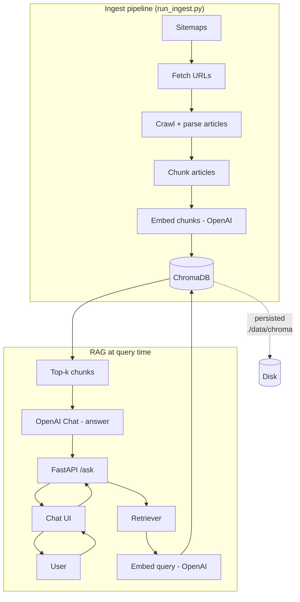
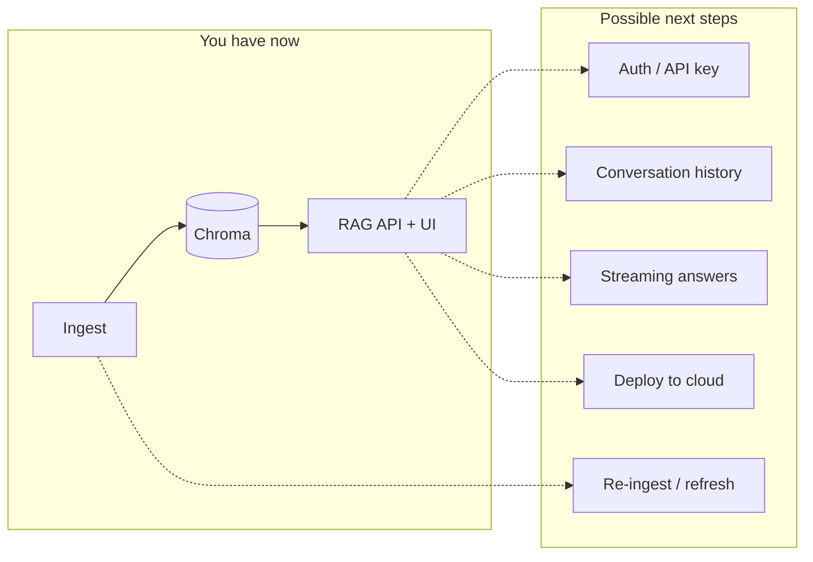

# TGC RAG MVP – Architecture

## Current system (what you have)

## What’s in each box

| Piece | What it does |
|-------|----------------|
| **Ingest** | Sitemaps → article URLs → fetch HTML → parse → chunk → embed → write to ChromaDB. Ctrl+C saves partial progress. |
| **ChromaDB** | Vector store: chunk text + embedding + metadata (title, author, URL). Lives in `./data/chroma`. |
| **Chat UI** | Single page at `/`: type question → call `POST /ask` → show answer + sources. |
| **FastAPI** | Serves UI and `POST /ask`. Loads ChromaDB + embedder, runs retriever + answer. |
| **Retriever** | Embeds the user query, runs similarity search in ChromaDB, returns top-k chunks. |
| **Answer** | Takes query + chunks, builds prompt, calls OpenAI chat, returns one answer. |

## What else you could add (optional)

- **Auth** – Protect `/ask` or the UI (e.g. API key header, login).
- **Conversation history** – Keep multi-turn context (e.g. store messages, pass last N to the LLM).
- **Streaming** – Stream the model response token-by-token in the UI (SSE or WebSocket).
- **Re-ingest / refresh** – Cron or script to re-run ingest for new/updated articles.
- **Deploy** – Run FastAPI + ChromaDB on a server (e.g. Railway, Fly.io) so others can use the UI.

---

**TL;DR:** Ingest fills ChromaDB with article chunks. The chat UI calls the API; the API retrieves chunks from ChromaDB and asks OpenAI to answer. Everything after “we have Chroma + chat UI” is optional polish and scale.
